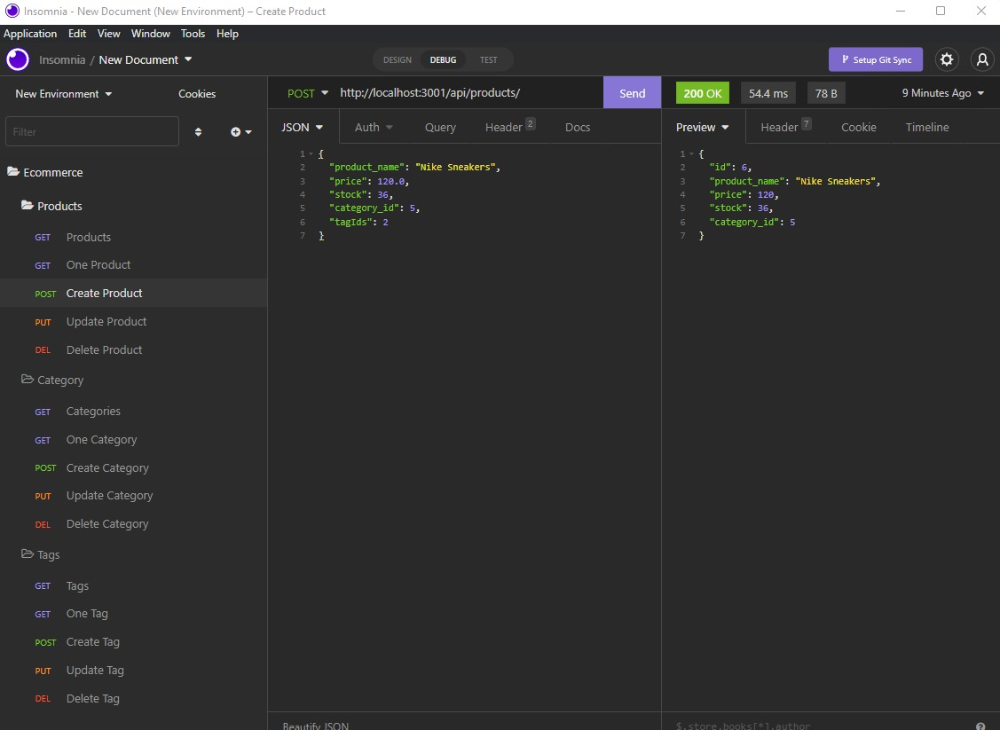

# E-commerce back-end App
Video Walkthrough: [https://drive.google.com/file/d/1luIi-Pekj4bjwWBW-NbnHGXmbdlvLD-J/view](https://drive.google.com/file/d/1luIi-Pekj4bjwWBW-NbnHGXmbdlvLD-J/view)
## ToC
- [Description](#description)
- [Features](#features)
- [Usage](#usage)
- [Preview](#preview)

## Description
Back End functionality using databases to create endpoints and models for products, categories and tags, allowing the user to view, create, update or delete them.
## Features 
- Sequelize.
- Insomnia.
- dotenv.
- mysql.
- routes.

## Usage
Open command line and enter 'npm start', navigate thru the menu and answer all the prompt questions.

## Preview

